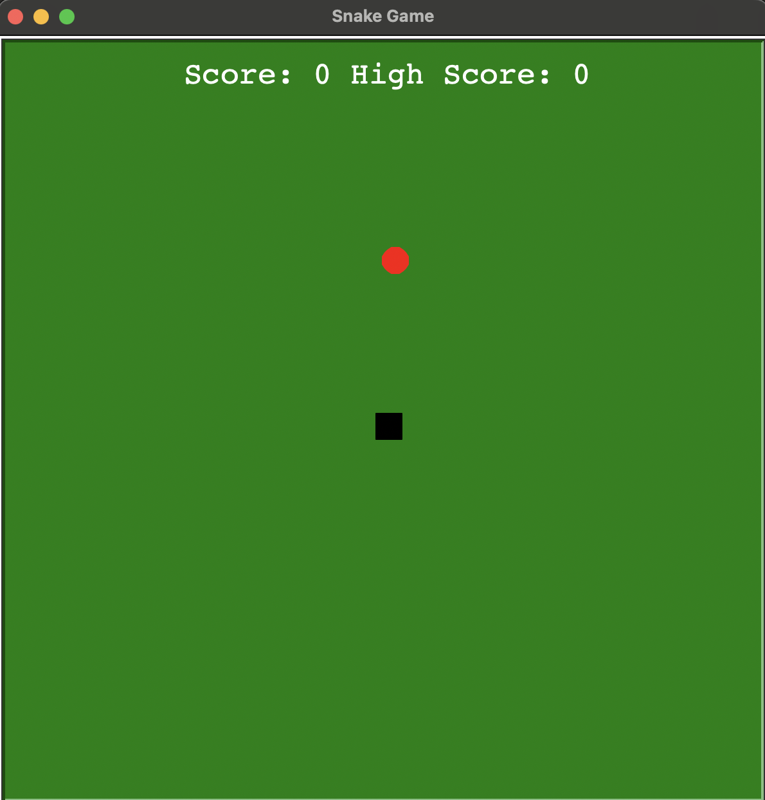
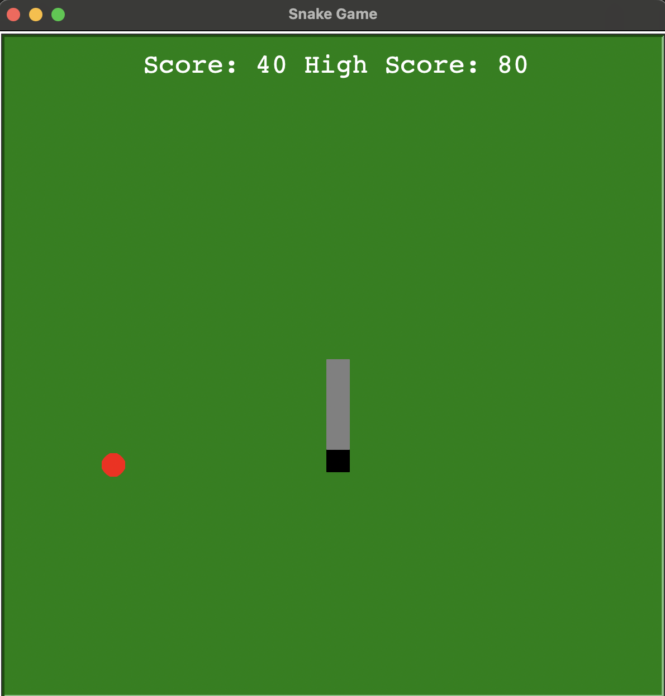
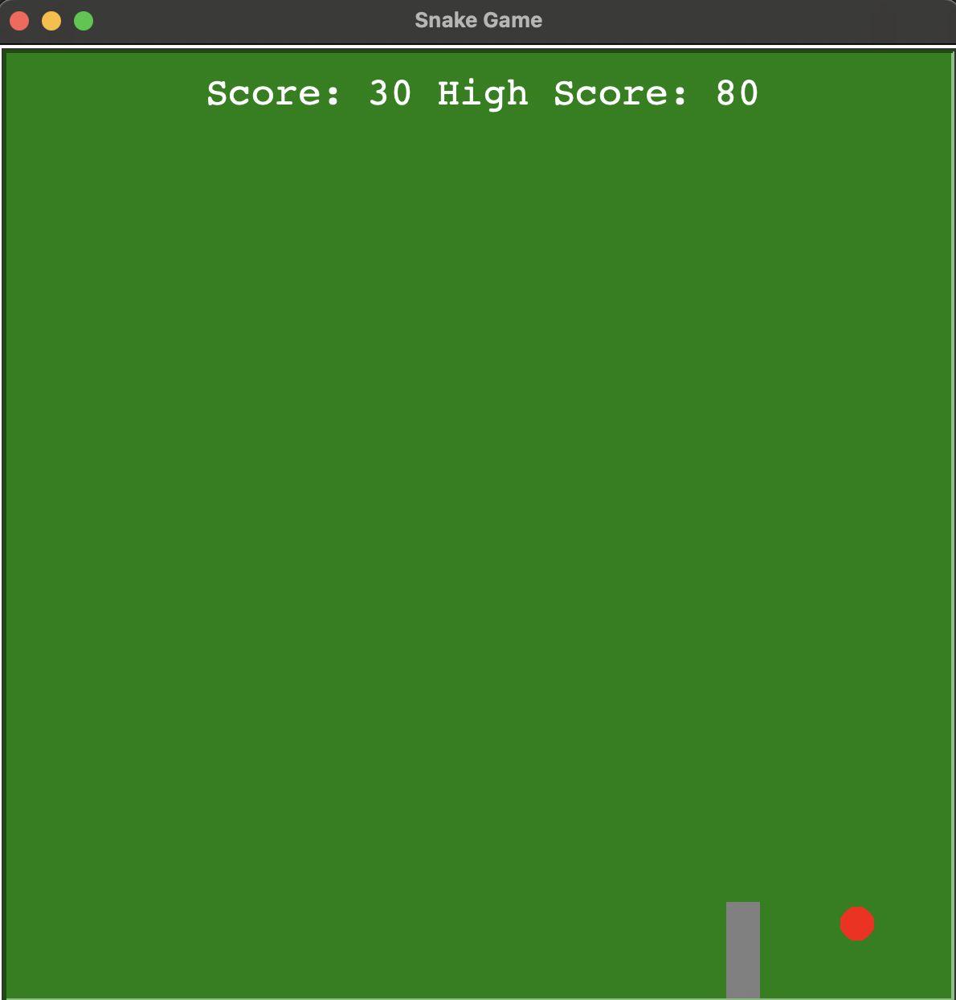

# 🐍 Snake Game

A modern take on the **classic Snake Game** built in Python using the **turtle graphics library**.  
Your mission: control the snake, eat the food, grow longer, and beat your own high score — but avoid hitting yourself or the borders!

---

## 📸 Screenshots

<p align="center">
  
  
  
</p>

---

## 🎮 Features
- **Smooth movement** with arrow key controls
- **Score tracking** with live updates
- **High score memory** — try to beat your previous record
- **Randomized food placement** every time
- **Game Over screen** when hitting borders or yourself
- **Customizable colors & speed**

---

## 🕹️ Controls
| Key             | Action        |
|-----------------|---------------|
| ⬆️ Arrow Up     | Move Up       |
| ⬇️ Arrow Down   | Move Down     |
| ⬅️ Arrow Left   | Move Left     |
| ➡️ Arrow Right  | Move Right    |

---

## 🚀 How to Run

### 1. Install Python
Make sure Python 3.8 or higher is installed.

### 2. Clone this repository
```bash
git clone https://github.com/mohd-ksr/snake-game.git
cd snake-game
```

### 3. Run the game
```bash
python snake.py
```
---

## 📜 License
This project is open source and available under the MIT License.

---
EOF


